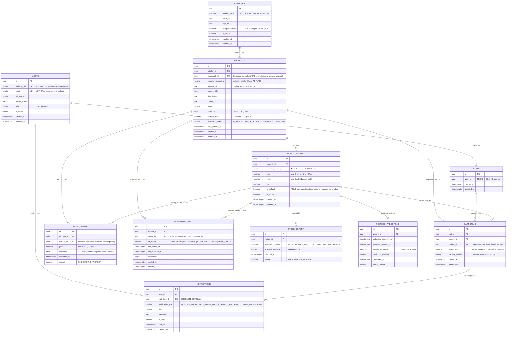

# Your_Cart - Entity Relationship Diagram

```mermaid
erDiagram
    USERS ||--|| CARTS : "has (1:1)"
    USERS ||--o{ NOTIFICATIONS : "receives (1:N)"
    
    RETAILERS ||--o{ PRODUCTS : "offers (1:N)"
    
    PRODUCTS ||--o{ PRODUCT_VARIANTS : "has (1:N)"
    PRODUCTS ||--o{ CART_ITEMS : "referenced_in (1:N)"
    PRODUCTS ||--o{ PRICE_HISTORY : "records (1:N)"
    PRODUCTS ||--o{ MONITORING_JOBS : "scheduled_for (1:N)"
    
    CARTS ||--o{ CART_ITEMS : "contains (1:N)"
    
    PRODUCT_VARIANTS ||--o{ CART_ITEMS : "selected_in (1:N)"
    PRODUCT_VARIANTS ||--o{ STOCK_HISTORY : "tracks (1:N)"
    PRODUCT_VARIANTS ||--o{ PRICE_HISTORY : "variant_pricing (0..1:N)"
    PRODUCT_VARIANTS ||--o{ MONITORING_JOBS : "monitors_variant (0..1:N)"
    PRODUCT_VARIANTS ||--o{ RESTOCK_PREDICTIONS : "predicted_for (1:N)"
    
    CART_ITEMS ||--o{ NOTIFICATIONS : "triggers (0..1:N)"

    USERS {
        uuid id PK
        varchar firebase_uid UK "NOT NULL, unique from Firebase Auth"
        varchar email UK "NOT NULL, lowercase normalized"
        varchar full_name
        text profile_image
        varchar role "USER | ADMIN"
        boolean is_active
        timestamptz created_at
        timestamptz updated_at
    }

    RETAILERS {
        uuid id PK
        varchar retailer_name UK "Amazon, Flipkart, Myntra, etc."
        text base_url
        text logo_url
        varchar integration_type "SCRAPER | OFFICIAL_API"
        boolean is_active
        timestamptz created_at
        timestamptz updated_at
    }

    PRODUCTS {
        uuid id PK
        uuid retailer_id FK
        text canonical_url UK "Canonical normalized URL (query/tracking params stripped)"
        varchar external_product_id "Nullable, retailer ID e.g. ASIN/PID"
        text original_url "Original submitted user URL"
        text product_title
        text description
        text image_url
        varchar brand
        char currency "ISO 4217 e.g. INR"
        numeric current_price "NUMERIC(12,2) >= 0"
        varchar availability_status "IN_STOCK | OUT_OF_STOCK | UNAVAILABLE | UNKNOWN"
        timestamptz last_checked_at
        timestamptz created_at
        timestamptz updated_at
    }

    PRODUCT_VARIANTS {
        uuid id PK
        uuid product_id FK
        varchar external_variant_id "Nullable variant SKU / identifier"
        varchar size "e.g. S, M, L, XL or NULL"
        varchar color "e.g. Black, Navy or NULL"
        varchar sku
        boolean is_default "TRUE for products with no options; max one per product"
        boolean is_active
        timestamptz created_at
        timestamptz updated_at
    }

    CARTS {
        uuid id PK
        uuid user_id FK,UK "Strict 1:1 user cart"
        timestamptz created_at
        timestamptz updated_at
    }

    CART_ITEMS {
        uuid id PK
        uuid cart_id FK
        uuid product_id FK
        uuid variant_id FK "References specific or default variant"
        numeric target_price "NUMERIC(12,2) > 0, nullable threshold"
        boolean tracking_enabled "Pause or resume monitoring"
        timestamptz created_at
        timestamptz updated_at
    }

    STOCK_HISTORY {
        uuid id PK
        uuid variant_id FK
        varchar availability_status "IN_STOCK | OUT_OF_STOCK | UNKNOWN | UNAVAILABLE"
        integer available_quantity "Nullable, >= 0"
        timestamptz checked_at
        varchar source "BACKGROUND_WORKER"
    }

    PRICE_HISTORY {
        uuid id PK
        uuid product_id FK
        uuid variant_id FK "Nullable, populated if variant-specific pricing"
        numeric price "NUMERIC(12,2) >= 0"
        char currency "ISO 4217, validated against parent product"
        timestamptz recorded_at
        varchar source "BACKGROUND_WORKER"
    }

    MONITORING_JOBS {
        uuid id PK
        uuid product_id FK
        uuid variant_id FK "Nullable, unique per product/variant pair"
        varchar job_status "SCHEDULED | PROCESSING | COMPLETED | FAILED | RATE_LIMITED"
        timestamptz next_check_at
        timestamptz last_checked_at
        integer retry_count
        timestamptz created_at
        timestamptz updated_at
    }

    NOTIFICATIONS {
        uuid id PK
        uuid user_id FK
        uuid cart_item_id FK "ON DELETE SET NULL"
        varchar notification_type "RESTOCK_ALERT | PRICE_DROP_ALERT | VARIANT_AVAILABLE | SYSTEM_NOTIFICATION"
        varchar title
        text message
        boolean is_read
        timestamptz sent_at
        timestamptz created_at
    }

    RESTOCK_PREDICTIONS {
        uuid id PK
        uuid variant_id FK
        timestamptz estimated_restock_from
        timestamptz estimated_restock_to
        numeric confidence_score "0.0000 to 1.0000"
        varchar prediction_method
        timestamptz generated_at
        varchar model_version
    }
```
